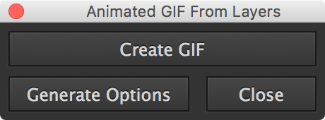

# Illy GIF!

**Quickly preview Illustrator layers as animated GIF.**

## Installation

First, install [ImageMagick<sup>®</sup>](http://www.imagemagick.org/) (assuming [Homebrew](http://brew.sh/) is your package manager):

```bash
$ brew install imagemagick
```

Use the below single-line Unix bash command to quickly install this script into your Illustrator `Scripts` folder.

```bash
bash <(curl -sL https://git.io/vwhQu)
```

Alternatively, you can dowload [`Animated GIF From Layers.jsx`](Animated GIF From Layers.jsx) into your Illustrator `Scripts` folder, located in the `/lllustrator CC/Presets` folder in your `lllustrator CC` installation directory.

The script’s filename, minus the file extension, will appear in the Scripts menu.

Run the script from the scripts menu in Illustrator.

Voilà!

## Usage

Palette window:



Click the “Create GIF” button; the code will create PNGs from your unlocked/printable layers and then use [ImageMagick<sup>®</sup>](http://www.imagemagick.org/) to generate an animated GIF which will open in a [Quick Look](https://en.wikipedia.org/wiki/Quick_Look) preview window.

Optionally, this script will utilize command line options for ImageMagick<sup>®</sup> via an “options” layer. Click the “Generate Options” button to create this layer (and some default options) automatically (feel free to customize from there).

Note that the top-most child layer will be the option set that gets used by ImageMagick<sup>®</sup>; this means you can have multiple different configurations … Just move the configuration you want to the top!

The only caveat, due to caching, is that you have to close and re-open the palette if you change configurations. 

**More documentation coming soon.**

---

Copyright © 2015-2016 [Michael Hulse](http://mky.io).

Licensed under the Apache License, Version 2.0 (the “License”); you may not use this work except in compliance with the License. You may obtain a copy of the License in the LICENSE file, or at:

[http://www.apache.org/licenses/LICENSE-2.0](http://www.apache.org/licenses/LICENSE-2.0)

Unless required by applicable law or agreed to in writing, software distributed under the License is distributed on an “AS IS” BASIS, WITHOUT WARRANTIES OR CONDITIONS OF ANY KIND, either express or implied. See the License for the specific language governing permissions and limitations under the License.


